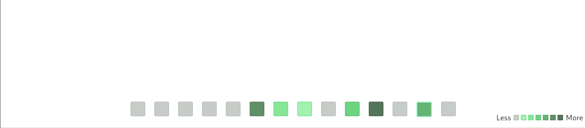
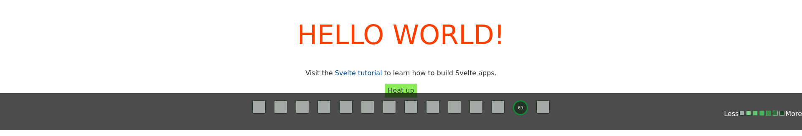

<h1 align="center">
    <a href="https://rutynka.io">
	
	</a>
</h1>

# Rutynka app helper

This is a simple svelte heatmap calendar based on local storage - routine helper for [Rutynka](https://rutynka.io) apps.

## Stand-alone live demo on [surge](https://surge.com)

https://helper-progress-calendar.surge.sh/

`prgs.store_progress()` in Web Inspector

---

## Get started

Clone and install the dependencies...

```bash
npx degit rutynka/helper-progress-calendar#main helper-progress-calendar
cd helper-progress-calendar
yarn install
```

https://betterstack.dev/blog/npm-package-best-practices/
...then start [Rollup](https://rollupjs.org):

```bash
yarn dev
```

Navigate to [localhost:5000](http://localhost:5000). You should see your app running. Edit a component file in `src`, save it, and reload the page to see your changes.

By default, the server will only respond to requests from localhost. To allow connections from other computers, edit the `sirv` commands in package.json to include the option `--host 0.0.0.0`.

If you're using [Visual Studio Code](https://code.visualstudio.com/) we recommend installing the official extension [Svelte for VS Code](https://marketplace.visualstudio.com/items?itemName=svelte.svelte-vscode). If you are using other editors you may need to install a plugin in order to get syntax highlighting and intellisense.
## Import as `Svelte Component` with bindings `this`



```bash
npx degit sveltejs/template my-svelte-project
cd my-svelte-project
yarn install
yarn install rutynka/helper-progress-calendar
yarn dev 
```

```js
//my-svelte-project/src/App.svelte
<script>
	import { Progress } from '@rutynka/helper-progress/src/Progress.svelte'
	export let name;

	let progress;

	function handleClick() {
		console.log('click', progress.store_progress())
	}
</script>

<main>
	<h1>Hello {name}!</h1>
	<p>Visit the <a href="https://svelte.dev/tutorial">Svelte tutorial</a> to learn how to build Svelte apps.</p>
	<button on:click={handleClick}>Heat up</button>
</main>
<Progress bind:this={progress}/>
```

## Building and running in production mode

To create an optimised version of the app:

```bash
npm run build
```

You can run the newly built app with `npm run start`. This uses [sirv](https://github.com/lukeed/sirv), which is included in your package.json's `dependencies` so that the app will work when you deploy to platforms like [Heroku](https://heroku.com).

## Single-page app mode

By default, sirv will only respond to requests that match files in `public`. This is to maximise compatibility with static fileservers, allowing you to deploy your app anywhere.

If you're building a single-page app (SPA) with multiple routes, sirv needs to be able to respond to requests for *any* path. You can make it so by editing the `"start"` command in package.json:

```js
"start": "sirv public --single"
```

## Using TypeScript

This template comes with a script to set up a TypeScript development environment, you can run it immediately after cloning the template with:

```bash
node scripts/setupTypeScript.js
```

Or remove the script via:

```bash
rm scripts/setupTypeScript.js
```

## Deploying to the web

### With [Vercel](https://vercel.com)

Install `vercel` if you haven't already:

```bash
npm install -g vercel
```

Then, from within your project folder:

```bash
cd public
vercel deploy --name my-project
```

### With [surge](https://surge.sh/)

Install `surge` if you haven't already:

```bash
npm install -g surge
```

Then, from within your project folder:

```bash
npm run build
surge public my-project.surge.sh
```
